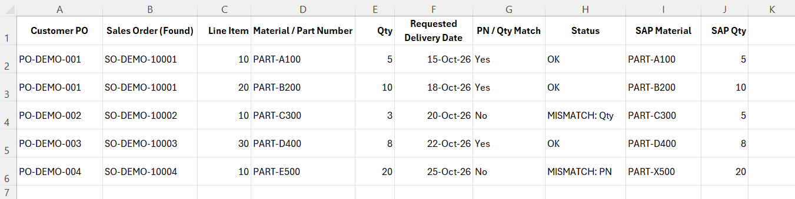

# Sales Order Delivery Requested Date Change Automation

**SAP ERP/ECC | Excel VBA | SAP GUI Scripting | Order Management**

> Automated high-volume Sales Order delivery date changes, reducing a **40+ minute manual process to approximately 10 minutes** with built-in validation.

---

## Business Problem

A key reseller frequently requested delivery date changes involving **100+ Sales Order line items**.

Because requests were often provided using Customer PO numbers rather than internal SAP Sales Order numbers, each item had to be manually searched, verified and updated in SAP.

Processing a large request could take **more than 40 minutes**, with repetitive work increasing the risk of incorrect or missed updates.

---

## Solution

I developed an **Excel VBA automation integrated with SAP GUI Scripting** that:

- Searches SAP using the Customer PO number.
- Locates the requested Sales Order line item.
- Retrieves the Material Number and Order Quantity.
- Validates SAP data against the Excel request.
- Updates the delivery date only after successful validation.
- Saves the change and logs the result in Excel.
- Automatically continues to the next request.

---

## Safety & Validation

> **Validate first, update second.**

Before making any SAP change, the automation verifies both the **Material Number** and **Order Quantity**.

If either value does not match, the update is skipped and the exception is logged for manual review.

---

## Business Impact

| Before | After |
|---|---|
| 100+ items took **40+ minutes** | Typically **~10 minutes** |
| Manual Sales Order search | Automated using Customer PO |
| Manual verification | Automated Material & Qty validation |
| Continuous user intervention | Minimal intervention |
| Manual exception tracking | Automatically logged |

### **100+ Line Items | 40+ Minutes → ~10 Minutes**

---

## Excel Demo

The Excel worksheet clearly separates user-provided request data from the SAP validation and processing results generated by the automation.

> All data shown in this demo is fictional and used for portfolio purposes only.

[View Demo Workbook](demo/SAP_delivery_date_automation_demo.xlsx)

---

## Technologies & Source Code

`SAP ERP/ECC` · `SAP VA02` · `SAP GUI Scripting` · `Excel VBA` · `Order Management`

[View VBA Source Code](src/SAP_delivery_date_automation_demo.bas)

> All company, customer and production SAP information has been removed or replaced with dummy data.
