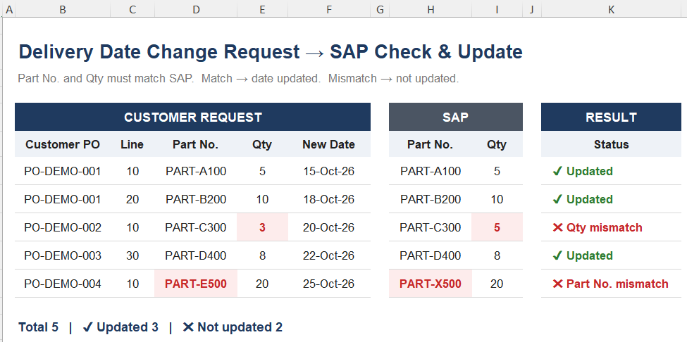

# SAP Delivery Date Automation

**SAP ERP/ECC | Excel VBA | SAP GUI Scripting | Order Management**

Automated high-volume sales order delivery date changes in SAP ECC, reducing a **40+ minute repetitive manual task to ~10 minutes using two automation methods**—by Line Item and by Part Number—with validation controls to improve processing accuracy.

---

## Business Problem

Delivery date change requests could involve **100+ line items**, requiring each item to be manually located, checked, and updated in SAP.

The manual process took **more than 40 minutes** for a large request and involved repetitive SAP processing, increasing workload and the risk of incorrect updates.

---

## Solution

I developed two Excel VBA automation methods using SAP GUI Scripting to process high-volume delivery date change requests.

### Method 1 — By Line Item

For requests containing a Line Item reference, the automation:

1. Reads the Customer PO, Line Item, Part Number, Quantity, and New Delivery Date from Excel.
2. Locates the requested Line Item in SAP ECC.
3. Retrieves the SAP Part Number and Quantity.
4. Validates the SAP values against the request.
5. Updates the delivery date only when both Part Number and Quantity match.
6. Records the processing result in Excel.

**Safety control:** Part No. and Qty must match SAP.

> **Match → Delivery date updated**  
> **Mismatch → No update**

### Method 2 — By Part Number

For requests using the Part Number as the item reference, the automation:

1. Reads the Customer PO, Part Number, and New Delivery Date from Excel.
2. Locates the corresponding Part Number / Material in SAP ECC.
3. Positions the relevant item for processing.
4. Updates the requested delivery date.
5. Records the processing result in Excel.

A fallback scan is used to locate the matching material if the item is not positioned as expected.

---

## Business Impact

| Area | Before | After |
|---|---|---|
| Processing | Manual SAP updates | Automated processing |
| Large request | 40+ minutes | ~10 minutes |
| Processing options | Manual item lookup | Line Item or Part Number automation |
| Validation | Manual checking | Automated PN/Qty validation for Line Item method |
| Error control | Dependent on manual verification | Validation prevents mismatched Line Item updates |
| Result tracking | Manual | Processing status recorded in Excel |

---

## Excel Demo

The demo below uses fictional data to illustrate the Line Item method, including SAP Part Number and Quantity validation.

### Demo Workbook

[View Demo Workbook](demo/SAP_delivery_date_automation_demo.xlsx)

### VBA Source Code

**Method 1 — By Line Item**  
[View Line Item VBA Source](src/SAP_delivery_date_by_line_item.bas)

**Method 2 — By Part Number**  
[View Part Number VBA Source](src/SAP_delivery_date_by_part_number.bas)

---

## Technologies

- SAP ERP / ECC
- SAP GUI Scripting
- Excel VBA
- Order Management
- Process Automation

---

*Portfolio version — company, customer, and production data have been removed or replaced with fictional examples.*
