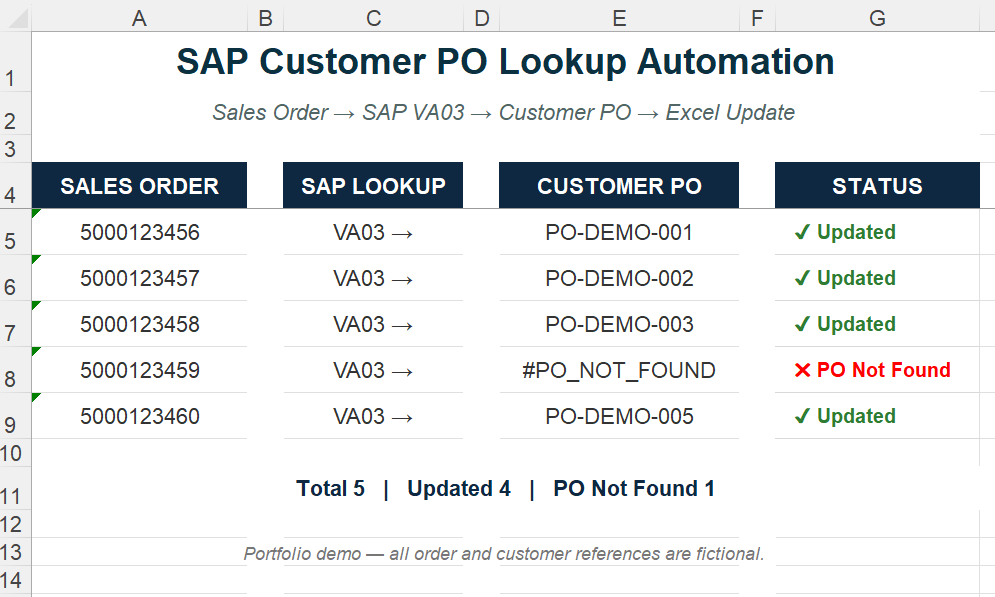

# SAP Customer PO Lookup & Excel Update Automation

**SAP ERP/ECC | Excel VBA | SAP GUI Scripting | Order Management**

Automated Customer PO retrieval from SAP ECC using Sales Order numbers, eliminating repetitive manual SAP lookups when preparing high-volume month-end order reconciliation reports for customers.

---

## Business Problem

Internally, orders were tracked using **SAP Sales Order numbers**, while customers referenced their orders using their own **Customer PO numbers**.

During month-end reconciliation, delivered order lists therefore had to be converted from internal Sales Order references to the corresponding Customer PO numbers before they could be shared with the customer.

With **100+ orders** in some month-end lists, manually opening each Sales Order in SAP, locating the Customer PO number, and updating Excel was repetitive and time-consuming.

---

## Solution

I developed an **Excel VBA automation using SAP GUI Scripting** to retrieve Customer PO numbers directly from SAP ECC.

The automation:

1. Reads the Sales Order number from Excel.
2. Opens the Sales Order in SAP using **VA03**.
3. Retrieves the corresponding Customer PO number.
4. Writes the Customer PO number back into the correct Excel row.
5. Continues automatically through the remaining Sales Orders.

### Data Flow

**Excel Sales Order → SAP VA03 → Customer PO → Excel Update**

---

## Controls & Error Handling

The automation includes controls to support reliable processing:

- Existing Customer PO values are not overwritten by default.
- Sales Orders not found in SAP are identified as `#NOT_FOUND`.
- Missing Customer PO information is identified as `#PO_NOT_FOUND`.
- Processing errors are identified as `#ERROR`.
- Multiple Excel order sections can be processed automatically.

---

## Business Impact

| Area | Before | After |
|---|---|---|
| Customer PO lookup | Manual SAP lookup | Automated SAP lookup |
| Month-end volume | 100+ orders may require individual lookup | Orders processed automatically |
| Excel update | Manual copy and entry | Automatic update |
| Existing PO data | Manual checking | Existing values protected by default |
| Customer reconciliation | Manual reference conversion | Customer PO references automatically retrieved |

---

## Excel Demo

The demo uses fictional Sales Order and Customer PO data to illustrate the automation workflow.

**Sales Order → SAP VA03 → Customer PO → Excel Update**

### Demo Workbook

[View Demo Workbook](./demo/SAP_customer_po_lookup_demo.xlsx)

### VBA Source Code

[View VBA Source](./src/SAP_customer_po_lookup.bas)

---

## Technologies

- SAP ERP / ECC
- SAP GUI Scripting
- Excel VBA
- Order Management
- Process Automation

---

*Portfolio version — company, customer, order, and production data have been removed or replaced with fictional examples.*
